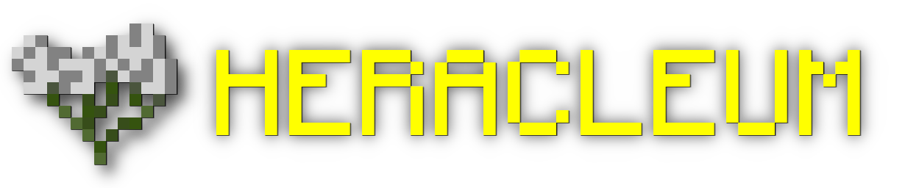
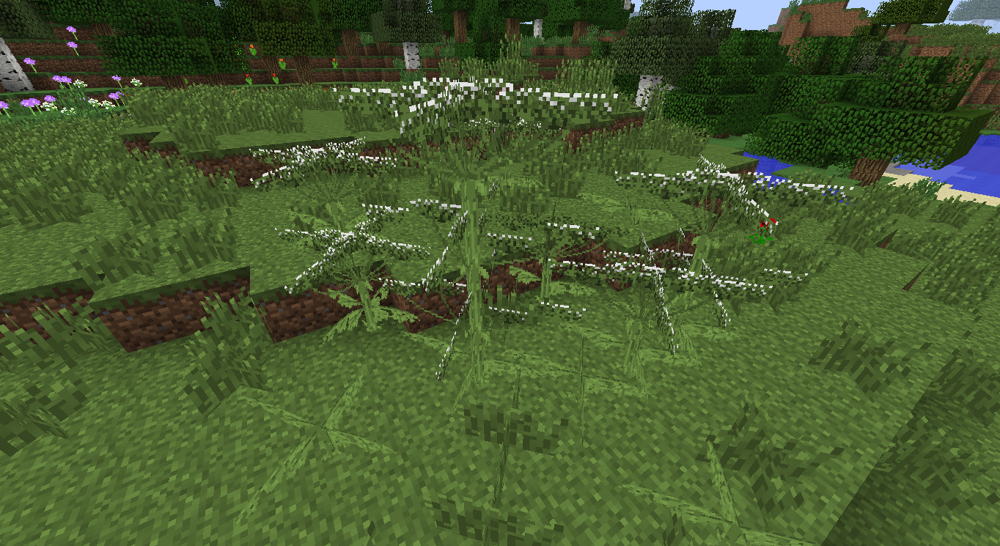
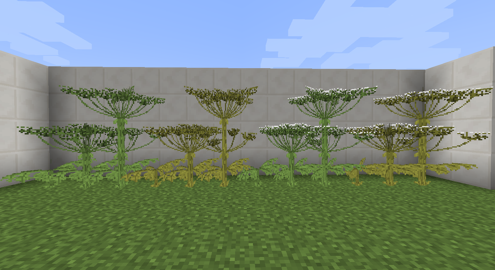
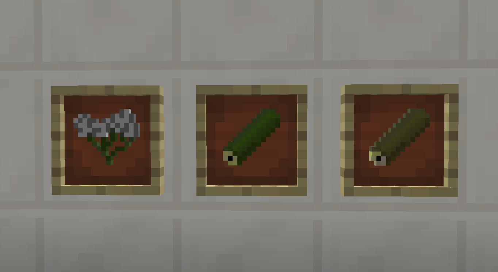

# Heracleum / work in progress

Immerse your world in the chaos of hogweed!

## What is heracleum?

Heracleum is a modification that adds a plant Sosnowsky's hogweed [(Heracleum sosnowskyi)](https://en.wikipedia.org/wiki/Heracleum_sosnowskyi "Wiki page") and related things.

## Why you made this mod?

Just for lulz

## Some screenshots

It will growth like that:

All types of heracleum plant:

Mod items:
